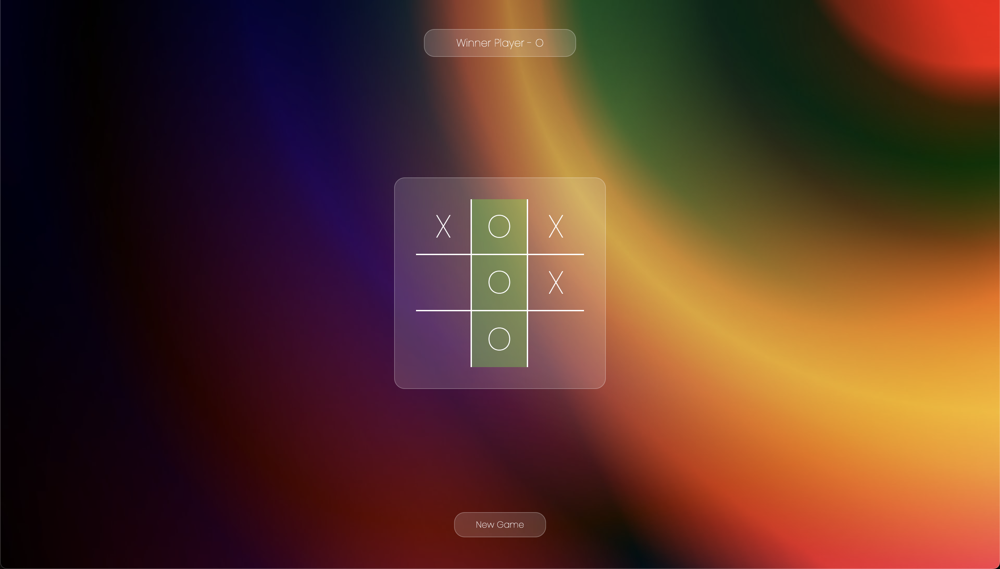

# Tic Tac Toe Game

Welcome to the Tic Tac Toe Game project! This simple web-based game allows two players to play the classic game of Tic Tac Toe (also known as Noughts and Crosses) in their web browsers. The project is built using HTML, CSS, and JavaScript.

## Table of Contents

- [Introduction](#introduction)
- [Features](#features)
- [Demo](#demo)
- [Getting Started](#getting-started)
- [How to Play](#how-to-play)

## Introduction

Tic Tac Toe is a well-known two-player game where the objective is to align three of your marks (either "X" or "O") in a row, column, or diagonal on a 3x3 grid. This project brings the classic game to the web with a user-friendly interface.

## Features

- Interactive game board with a visually appealing design.
- Two-player mode for playing against a friend.
- Clear game information and current player display.
- Game over detection for wins and ties.
- Responsive design for various screen sizes.
- Reset button to start a new game.

## Demo

You can check out a live demo of the Tic Tac Toe Game here: [Live Demo](https://tic-tac-toe-naman-anand.netlify.app/)

## Getting Started

To run the Tic Tac Toe Game locally, follow these steps:

1. Clone the repository to your local machine: `git clone https://github.com/NamanAnand13/Tic-Tac-Toe.git`

2. Navigate to the project directory: `cd tic-tac-toe-game`

3. Open the `index.html` file in your web browser to start playing the game.

That's it! You can now enjoy a game of Tic Tac Toe with a friend.

## How to Play

1. When you open the game, you'll see a 3x3 grid representing the Tic Tac Toe board.

2. Players take turns to click on an empty cell to place their mark ("X" or "O").

3. The game will automatically detect wins (three in a row, column, or diagonal) or ties.

4. To start a new game, simply click the "New Game" button.

---

Enjoy playing Tic Tac Toe with your friends, and feel free to contribute to the project or customize it to your liking. If you have any questions or feedback, please don't hesitate to reach out.

Have fun gaming!